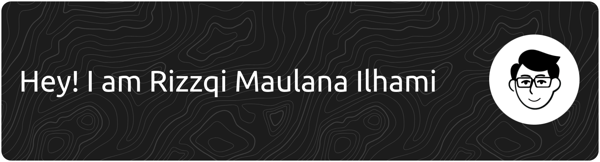

Web Developer focused on building clean, responsive, and user-friendly web experiences while exploring frontend development and UI/UX design.

## About Me

- Learning frontend development through practical web projects
- Exploring UI/UX design to create better user experiences
- Interested in clean layouts, responsive design, and accessible interfaces
- Building projects to improve my design-to-code skills

## Tech Stack

**Frontend:**

**Design:**

**Tools:**

## Current Focus

- Frontend fundamentals
- Responsive web design
- UI/UX design principles
- Accessibility basics

## Projects

- Portfolio Website - Personal website to showcase my work
- Landing Page Practice - Responsive landing pages from design references
- UI Components - Small reusable interface components

## GitHub Stats

## Contact

- LinkedIn: https://www.linkedin.com/in/rizzqimaulanailhami/
- Portfolio: https://rizzqimln.my.id
- Email: rizzqimaulanailhami@gmail.com
